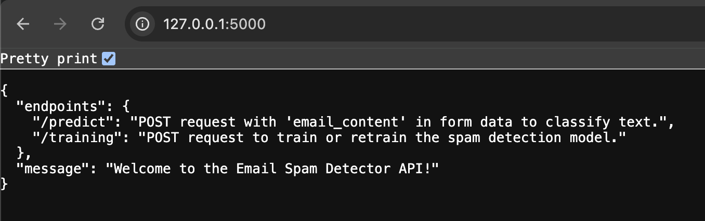

# NLP based Spam Classifier

# Docker Image: https://hub.docker.com/r/archanaburadkar/spam-detector

An NLP based Spam Classifier built in Python.

## Steps to run the project locally

Follow these steps to get the project up and running on your local machine.

### Prerequisites

-   Python 3.x (3.8+ recommended)
-   `pip` (Python package installer)

### 1. Clone the Repository

First, clone the project repository from GitHub

```bash
git clone https://github.com/Aaliya-Ali/nlp-spam-classifier.git
cd email-spam-detector
```

### 2. Create and Activate a Virtual Environment

It's highly recommended to use a virtual environment to manage project dependencies and avoid conflicts with other Python projects.

On macOS/Linux:

```bash
python3 -m venv venv
source venv/bin/activate
```

On Windows:

```
py -m venv venv  # or python -m venv venv
venv\Scripts\activate
```

(You should see (venv) at the beginning of your terminal prompt after activation.)

### 3. Install Python Dependencies

Install all the required Python libraries using pip:

```
pip install -r requirements.txt
```

### 4. Download NLTK Data

The project uses NLTK for text processing, which requires specific data packages. Download them once:

With your virtual environment activated, run the Python interpreter and execute the following commands:

```bash
python
```

or

```bash
python3
```

Then, in the Python prompt (>>>):

```
import nltk
nltk.download('punkt')
nltk.download('stopwords')
nltk.download('punkt_tab')
exit()
```

### 5. Place the Dataset

Download the sms-spam-collection-a-more-diverse-dataset (train.csv) from Kaggle:
https://www.kaggle.com/datasets/thedevastator/sms-spam-collection-a-more-diverse-dataset

Create a data directory in the root of your project and place the downloaded train.csv file inside it:

```
email-spam-detector/
└── data/
    └── train.csv
```

### 6. Run the Flask API

Run the Flask API locally:

```bash
python3 app.py
```

Your API should now be accessible on http://127.0.0.1:5000/


DONE! 🎉 You can now start interacting with the API by sending requests.✨
